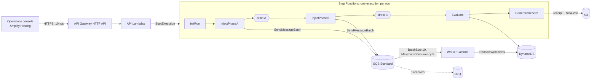

# DisburseProof

**A reliability sandbox for benefit-disbursement pipelines.** Load a batch of synthetic scholarship beneficiaries, run a deterministic duplicate-delivery experiment against a disbursement processor on real AWS infrastructure, and get an evidence-backed verdict on whether every eligible student was paid **exactly once**.

> Retries delivered 12 payment events twice. The vulnerable processor paid those 12 students twice, and because the budget is fixed, **12 other eligible students received ₹0**. The protected processor, on the identical workload, paid all 100 exactly once.

> **Synthetic sandbox — no real money or personal data.** No bank APIs, no Aadhaar or other PII, and no claim about how PFMS, NSP or any government system is built. A PASS means *one business effect per entitlement under the tested replay*. It does not mean "exactly-once delivery", and it does not prove anything about future executions.

- **Live app:** https://main.d194gkph6yfxxv.amplifyapp.com
- **API:** https://5f1ru6pgai.execute-api.ap-south-1.amazonaws.com (try `GET /overview`)

## The problem

Distributed systems retry. A payment instruction can reach the payer twice: a timeout makes the sender retry, a queue redelivers, a worker crashes after paying but before acknowledging. Delivering twice is normal. **Paying twice** is the bug, and with a fixed budget it has a victim: every duplicate payment is money another eligible student does not get.

DisburseProof turns that failure, which usually stays hidden until reconciliation, into a repeatable experiment with a verdict computed from the ledger.

## What the demo shows

Batch: 100 students × ₹10,000, budget ₹10,00,000. Experiment: seed `FC-2026-0918`, D = 12 duplicated payment events, 112 deliveries in two phases.

| Metric | Vulnerable | Protected |
|---|---|---|
| Deliveries | 112 | 112 |
| Ledger effects (payments) | 100 | 100 |
| Students paid twice | 12 | 0 |
| Students paid ₹0 | **12** | 0 |
| Duplicates suppressed | 0 | 12 |
| Rejected: budget exhausted | 12 | 0 |
| Misallocated amount | ₹1,20,000 | ₹0 |
| Budget guard (spent ≤ budget) | PASS | PASS |
| Invariant: ≤1 payment per entitlement | **FAIL** | PASS |
| Invariant: every eligible student paid | **FAIL** (88/100) | PASS (100/100) |
| Verdict | **FAIL** | **PASS** |

These are the values the smoke test asserts. The app hard-codes none of them: every number is computed from DynamoDB after the run.

**Observed on AWS** (`python tests/integration/smoke_test.py --stack disburseproof-dev`, ap-south-1, 19 Sep 2026):

```
Metric                            Vulnerable                            Protected
deliveries                        112                                   112
ledger_effects                    100                                   100
double_paid                       12                                    0
unpaid                            12                                    0
duplicates_suppressed             0                                     12
budget_exhausted                  12                                    0
misallocated_paise                12000000                              0
budget_guard                      PASS                                  PASS
one_payment_per_entitlement       FAIL                                  PASS
every_eligible_paid               FAIL                                  PASS
every_eligible_paid_detail        88/100 eligible entitlements paid     100/100 eligible entitlements paid
verdict                           FAIL                                  PASS
vulnerable: run run_01M2W96E2MKW8SPSWC1DRBJVQR  duration 10110 ms  receipt sha256 e9b413ada96d56d9…
protected: run run_01M2W96YFSERESJHW49KRKB53C  duration 5072 ms  receipt sha256 60fe452658f28ff4…

SMOKE TEST PASSED: every value matches the headline table.
```

And the protected path under real contention (`concurrency_test.py`: 20 parallel worker invocations, one entitlement):

```
Outcomes: {'DUPLICATE_SUPPRESSED': 19, 'COMMITTED': 1}
Ledger effects: 1   budget debited: 1000000 paise   claim present: True
CONCURRENCY TEST PASSED
```

## What is synthetic and what is real

| Synthetic | Real |
|---|---|
| Beneficiaries, names (a fixed list of first names and surnames), amounts, schemes | AWS Step Functions executions, SQS deliveries, Lambda invocations |
| The "payment" is a row in a DynamoDB ledger table | DynamoDB transactions, conditional writes and their failures |
| No money moves; no bank or government API is called | Receipts in S3 with SHA-256 checksums, CloudWatch logs and metrics |

## Architecture



More detail, including the table design and data flow, is in [docs/architecture.md](docs/architecture.md).

### Why each AWS service is here

- **SQS Standard + DLQ.** At-least-once, unordered delivery is exactly the behaviour under test. After 5 failed receives a message moves to the dead-letter queue, where a drain timeout reports it.
- **Lambda.** The work is bursty: a run lasts about half a minute and nothing runs between runs. No reserved concurrency (new accounts may have a low quota); the SQS event source's `MaximumConcurrency: 5` caps the worker instead.
- **Step Functions (Standard).** Orchestrates the two phases with drain barriers, retries and a catch-all failure path. Its execution history is also evidence, shown in the app's AWS evidence drawer.
- **DynamoDB (on-demand).** Conditional writes and multi-table transactions make the protected path atomic. It is also the record every verdict is computed from.
- **S3.** Receipts, uploaded with a SHA-256 checksum that S3 verifies.
- **API Gateway HTTP API.** The cheapest managed front door, with CORS and throttling (10 rps, burst 20).
- **Amplify Hosting.** Static hosting for the Vite build, with SPA rewrites for deep links.
- **CloudWatch.** One JSON object per log line, queryable by `run_id`, plus Embedded Metric Format metrics such as `TransactionConflictRetries`.

**Cut on purpose:** EventBridge (the injector sends to SQS directly), Bedrock (no AI is needed to count payments), Cognito (single demo operator), KMS signing (a fingerprint is enough for a sandbox; see below), X-Ray.

## How it works

### Two-phase determinism

SQS Standard does not preserve order. If all 112 deliveries were sent at once, the budget would run out at an order-dependent moment, so even the *number* of starved students would change between runs. Instead, **Phase A** (the retry wave) delivers each of the 12 duplicated events twice, and **Phase B** delivers the other 88 once, and starts only after every Phase A delivery is recorded. A vulnerable processor then always pays 24 times in Phase A, leaving budget for 76 of the 88 Phase B students: exactly 12 receive ₹0. *Which* 12 still depends on SQS order, and the app says so. In general, with N students and D duplicates, `1 ≤ D ≤ ⌊N/2⌋` and the vulnerable run starves exactly D when all amounts are equal. See [ADR 0001](docs/adr/0001-two-phase-injection.md).

### Why the protected path is one TransactWriteItems

**This is the core engineering point.** The protected processor makes four writes in one DynamoDB transaction:

1. Put the idempotency record, only if the key does not exist.
2. Debit the run's budget, only if enough remains, and count the delivery.
3. Put the ledger effect (the payment).
4. Put the Deliveries row, only if this delivery ID is not recorded.

**Because the business effect and its idempotency record commit atomically, a crash can never leave a key "claimed but unpaid".** Nor can it leave a payment without its claim. A Lambda timeout, crash or SQS redelivery at any instant leaves either nothing or a complete, recorded payment.

**Check-then-write is unsafe.** Reading the key and then writing leaves a window in which two concurrent deliveries both read "not paid" and both pay. Writing the claim first and paying second leaves a window in which a crash strands the claim and the student is never paid. The naive processor exists to demonstrate the first failure.

When DynamoDB cancels the transaction, `CancellationReasons` (one per item, in order) decide what happened: an existing Deliveries row means an SQS redelivery (acknowledge), an existing claim means a business duplicate (record `DUPLICATE_SUPPRESSED`), and a failed budget condition means `BUDGET_EXHAUSTED`. A `TransactionConflict` on the busy Runs item is retried with full-jitter backoff (6 attempts, 1 s cap) before SQS redelivers. See [ADR 0002](docs/adr/0002-transactional-idempotency.md) and [`protected.py`](backend/src/processors/protected.py).

### Why `run_id` is in the idempotency key

```
<run_id>#<scheme_id>#<beneficiary_id>#<academic_year>#INST-<installment>
```

The key is built only from business fields, never from an SQS message ID, delivery ID, timestamp or retry count. The `run_id` prefix makes every run an isolated sandbox, so replaying the experiment tomorrow is not suppressed by today's run. **In production the key would be the business identity alone**, because an entitlement must be paid once ever, not once per run. See [ADR 0003](docs/adr/0003-run-scoped-idempotency-key.md).

### Deterministic delivery IDs

Delivery IDs are `uuid5(run_id, phase, logical_event_id, copy)` rather than random. If Step Functions retries an inject task after it had already sent some messages, the re-sent messages carry the same IDs and are absorbed like SQS redeliveries, so a transient error cannot inflate the counts. This was a deliberate change from the original design; see [ADR 0004](docs/adr/0004-deterministic-delivery-ids.md).

### Evidence, not claims

- The **replay fingerprint** is the SHA-256 of the experiment definition in canonical JSON. Both runs in a comparison share it, which shows they processed the identical workload. It is a fingerprint, not a signature: it is not tamper-proof.
- The **evaluator** is plain code. It recomputes every count from Ledger, Deliveries and Batches rows with strongly consistent reads, and fails closed if the number of recorded deliveries is not N + D.
- The **receipt** is canonical JSON in S3. Its SHA-256 is stored on the run; the API re-hashes the S3 object, and the receipt page re-hashes the downloaded bytes in the browser with Web Crypto.
- The **AWS evidence drawer** reads the Step Functions execution history, SQS queue depths and the run's CloudWatch log lines live.

## Cost

Everything is serverless and on-demand, so idle cost is near zero: no instances, no provisioned capacity, and 14-day log retention. One run is roughly 112 SQS messages, about a hundred Lambda invocations, around a thousand DynamoDB write request units (transactional writes cost double) and 30 to 60 Step Functions state transitions. That is a fraction of a US cent per run at ap-south-1 list prices. The main cost risk is a public, unauthenticated endpoint, so `POST /runs` refuses new runs while 2 are active, and the API is throttled to 10 requests per second.

## Limitations

- **No authentication.** A single demo operator; anyone with the URL can start runs (rate limited and capped at 2 concurrent runs).
- **Synthetic data only.** Do not upload real names or personal data through the CSV import.
- **The Runs item is a deliberate hot key.** Every delivery updates the run's budget and counters, so workers contend for one item. That is fine at 5 concurrent workers and 500 entitlements, and is measured by the `TransactionConflictRetries` metric; it would not scale to production volumes, where the budget would be sharded or reserved per partition.
- **Not tested against real payment providers.** The ledger is a DynamoDB table; there is no bank integration, reconciliation file or settlement.
- **The vulnerable processor is not crash-safe by design.** If a Lambda dies between its budget debit and its ledger write, SQS redelivery can debit again. That is realistic, but it would move the smoke-test numbers; it is reported, not hidden.
- **Which students are starved varies** between vulnerable runs; only the count is fixed (for equal amounts).

## Repository layout

```
backend/              AWS SAM application (Python 3.12)
  template.yaml       all infrastructure
  statemachine/       Step Functions definition
  src/handlers/       Lambda entry points only (API, worker, workflow tasks, seed)
  src/domain/         pure business logic, no AWS imports
  src/processors/     vulnerable, protected and naive processors behind one interface
  src/adapters/       all AWS access (one repository per DynamoDB table)
  src/services/       use cases combining domain logic and adapters
  tests/unit/         pytest, no AWS
  tests/integration/  smoke and concurrency tests against the deployed stack
frontend/             Vite + React + TypeScript + Tailwind operations console
docs/                 architecture and ADRs
scripts/              frontend deployment to Amplify
```

## Deploy

Prerequisites: an AWS account, AWS CLI v2 with credentials configured (`aws configure`), AWS SAM CLI, Python 3.12 and Node.js 22+.

```bash
cd backend
sam build
sam deploy            # stack disburseproof-dev in ap-south-1; see samconfig.toml
cd ..
pip install -r backend/requirements-dev.txt
python scripts/deploy_frontend.py      # builds with VITE_API_URL from the stack and uploads to Amplify
```

The stack seeds the demo batch and experiment on deploy. Its outputs include `ApiUrl` and `FrontendUrl`.

## Test

```bash
cd backend
pip install -r requirements-dev.txt
ruff check . && ruff format --check . && mypy && pytest          # unit tests, no AWS needed
python tests/integration/smoke_test.py --stack disburseproof-dev  # both processors on AWS, asserts the table above
python tests/integration/concurrency_test.py --stack disburseproof-dev  # 20 parallel copies, exactly one payment
```

```bash
cd frontend
npm ci && npm run lint && npm run typecheck && npm run build
```

GitHub Actions runs ruff, mypy, pytest, `sam validate --lint`, and the frontend lint, typecheck and build on every push.

## What I learned

- **Delivery is not the unit of correctness; the business effect is.** Deduplicating on the delivery or message ID feels safe and is not: a retry arrives as a new delivery. The key has to be the entitlement.
- **Atomicity beats cleverness.** Putting the claim, the budget debit, the payment and the delivery record in one `TransactWriteItems` removed a whole class of crash windows that no amount of careful ordering could close.
- **Cancellation reasons need an order.** A redelivered message fails the delivery condition *and* the idempotency condition; checking them in the wrong order would have recorded a redelivery as a new duplicate.
- **A hot key is visible in real logs.** The live runs show `"attempt": 2` on some deliveries: DynamoDB really does cancel concurrent transactions on the shared Runs item, and bounded jittered retries absorb it.
- **Determinism is designed, not hoped for.** SQS Standard does not preserve order, so the two-phase injection is what makes "12 students received ₹0" a repeatable result rather than a range, and deterministic delivery IDs keep a retried injection from inflating it.
- **Small things break demos.** A curly brace in a YAML flow mapping (`/runs/{run_id}`), a monospace font without a ₹ glyph, and a stale PATH in an old terminal each cost time; checking the font files and validating the template locally found them before judges did.

## License

MIT
