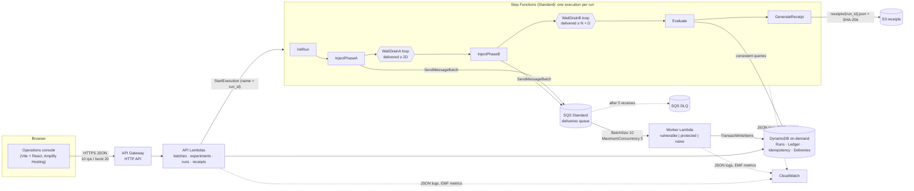

# Architecture

## Components

## Data flow for one run

1. `POST /runs` checks the active-run cap (a cost guard for a public API), writes the Run record (`QUEUED`) and starts an execution whose name is the run ID, so a retried start cannot create a second execution.
2. **InitRun** moves the run to `RUNNING` and resets its budget and counters.
3. **InjectPhaseA** re-hashes the batch, compares it with the experiment's `batch_content_sha256`, and sends 2D deliveries (copy 1 of every duplicated event, then copy 2). Delivery IDs are deterministic (ADR 0004).
4. The **worker** processes each message with the processor named on the Run record. Every outcome is written to Deliveries and counted on the Run item in the same transaction.
5. **WaitDrainA** loops (Wait 2 s → check → choice) until `delivered_count ≥ 2D`, or fails the run with `DRAIN_TIMEOUT` after 90 checks and reports the DLQ depth.
6. **InjectPhaseB** and **WaitDrainB** do the same for the remaining N − D events (target N + D).
7. **Evaluate** reads every Ledger, Deliveries and Batches row with strongly consistent queries, checks the delivery count equals N + D (otherwise it fails closed), and computes the counts and three invariants.
8. **GenerateReceipt** re-evaluates, checks the verdict matches, writes canonical JSON to S3 with a SHA-256 checksum, stores the hash on the run and marks it `COMPLETED`.
9. Any error is caught by **MarkFailed**, which records the reason and message on the run; the UI shows it.

## Tables

| Table | Key | Written by |
|---|---|---|
| Batches | `batch_id`, `sk` = `META` or `ENT#<beneficiary>#<installment>`; sparse GSI on META rows | API (create), seed |
| Experiments | `experiment_id` = `exp_` + first 16 hex of the fingerprint; GSI by batch | API, seed |
| Runs | `run_id`; sparse GSI `entity_type`/`created_at` for listing | API, workflow, worker (counters) |
| Ledger | `run_id`, `sk` = `EFFECT#<effect_id>` | worker |
| Idempotency | `idem_key` = `<run_id>#<entitlement key>` | worker (protected, naive) |
| Deliveries | `run_id`, `sk` = `DELIVERY#<delivery_id>` | worker |

## Why each service

| Service | Why it is here | What was cut |
|---|---|---|
| SQS Standard + DLQ | At-least-once, unordered delivery is the behaviour under test. The DLQ makes stuck messages visible. | FIFO (would hide the problem), EventBridge (not needed to reach SQS) |
| Lambda | Bursty work: a run lasts seconds; nothing runs between runs. | Containers, reserved concurrency (new accounts may not allow it) |
| Step Functions (Standard) | Two phases with drain barriers, retries, a catch-all failure path and an execution history that doubles as evidence. | Express workflows (no long-lived history), hand-rolled orchestration |
| DynamoDB on-demand | Conditional writes and multi-table transactions make the protected path atomic. Pay per request. | Relational DB (always-on cost) |
| S3 | Durable, cheap receipts with a server-verified SHA-256 checksum. | KMS signing (out of scope) |
| API Gateway HTTP API | Cheapest managed HTTP front door, with CORS and stage-level throttling. | REST API, Cognito (single demo operator) |
| Amplify Hosting | Static hosting with HTTPS and SPA rewrites from a zip upload. | Server-side rendering |
| CloudWatch | JSON logs queryable by `run_id`, EMF metrics without extra API calls, 14-day retention. | X-Ray (cost, not needed for the story) |
